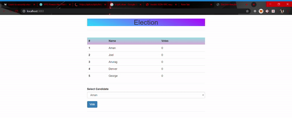
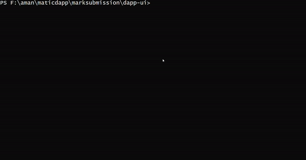

# CMS-Dapp :sparkles:
The aim is to make the system adopt paperless transactions and at the same time, maintain data integrity using blockchain.So we are trying to develop Dapp as a service :heart_eyes:

 <h3> Tech stack used: :octocat: </h3>

<li>Visual Code Studio</li>
<li>Ethereumjs</li>
<li>Maticjs</li>
<li>nodejs</li>
<li>truffle</li>
<li>ganache-cli</li>
<li>solidity</li>


## Voting Dapp

**Advantages of voting via blockchain**
<li>Transperency</li>
<li>Security</li>
<li>Anonymity</li>
<li>Low processing time</li>

<h3>Installation :gem: </h3>

1. **:round_pushpin: clone the repository.**

   ```shell
   $git clone https://github.com/Aman-zishan/cmsDapp.git

   ```
2. **:checkered_flag: navigate to election folder.**

   ```shell
   $cd election

   ```
3. **:construction: install the dependencies.**

   ```shell
   $npm install

   ```
4. **:diamonds: Run the truffle.**

   ```shell
   #This command executes the smart contract sequentially and sets local blockchain network.(make sure ganache is running)
   
   $truffle migrate --reset

   ```
5. **:dart: Deploy!**
    ```shell
    
    #This command runs the client side application.
    
   $npm run deploy

   ```
   ## DEMO
   
 
   
  <h3>Installation :gem: </h3>
  
## Mark submission Dapp
 We took this use case as there have been cases where marks have been tampered with after it has been published.For example inflation of marks just to increase the pass grades is a common issue.Since the data amount is huge we used matic so that this Dapp can be scaled since it is based on an adapted implementaton of plasma framework,we basically deployed our smart contract on Matic testnet :sparkles: 
   
1. **:round_pushpin: navigate to maticdapp folder.**

   ```shell
   $cd maticdapp

   ```
2. **:construction: navigate to marksubmission.**

   ```shell
   $cd marksubmission

   ```
3. **:checkered_flag: install the dependencies.**

   ```shell
   $npm install

   ```
3. **:construction: navigate to dapp-ui.**

   ```shell
   $cd dapp-ui

   ```
4. **:diamonds: install dependencies**
    ```shell
   $npm install
5. **:dart: deploy!**
    ```shell
   $npm run dev
   ```
  ## DEMO
   
 

